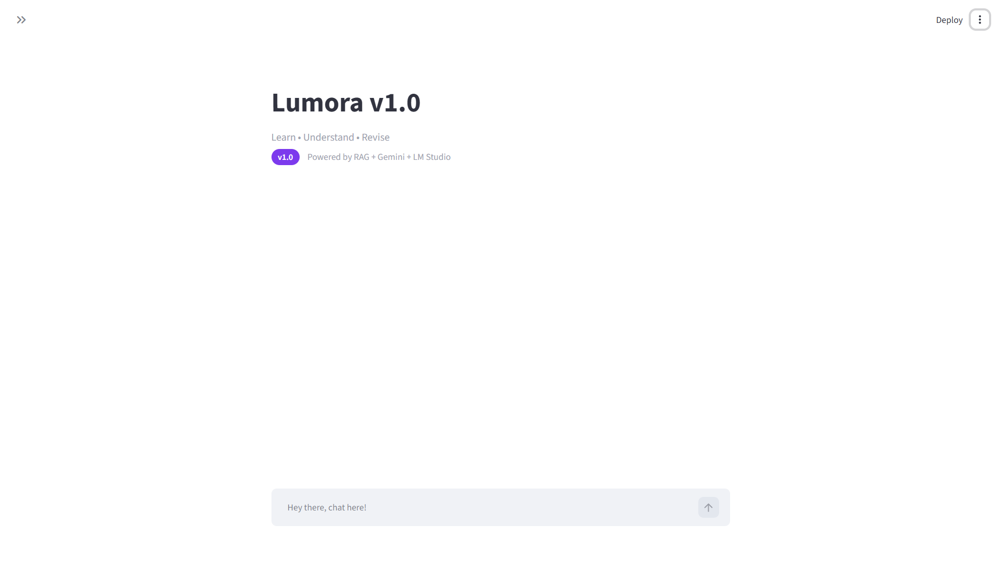
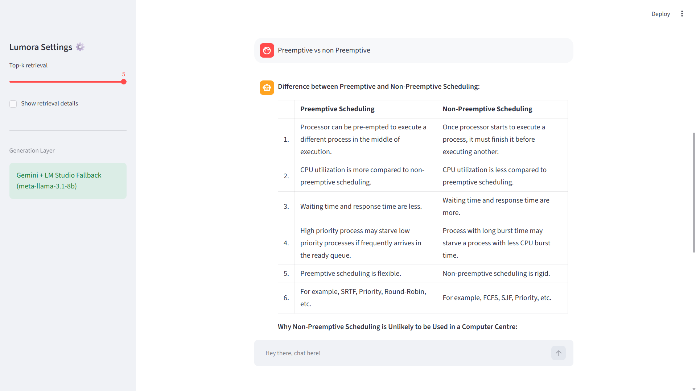
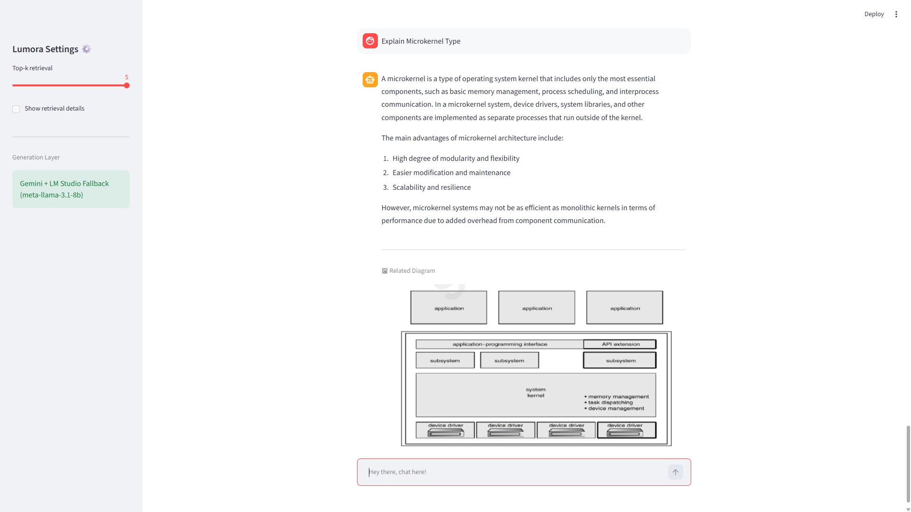

# ✨ Lumora v1.0 ✨

Learn • Understand • Revise

Lumora is an AI-powered study assistant built using Retrieval-Augmented Generation (RAG), Gemini, FAISS and semantic retrieval for AKTU semester learning.

Currently, Lumora supports detailed Q/A for the subjects Technical Communication and Operating System.

Lumora supports confidence filtering and has hallucination guard.

## Demo

### Quick Preview

### Screenshots

#### Home Interface

#### Chat + Retrieval

#### Diagram Layer

## Features

- Conversational study assistant
- RAG-based semantic retrieval
- Gemini answer generation + Local LLM Support
- Diagram-aware responses
- Persistent chat history
- Confidence filtering / hallucination guard
- Has Streamlit interface

## Architecture

Academic PDFs
→ Mistral OCR (done externally)
→ Gemini Cleanup
→ Chunking
→ Embeddings
→ FAISS
→ Retrieval + Generation
→ Gemini Response Generation + Local LLM Fallback (Meta-Llama-3.1-8B)
→ Lumora

Note:
Mistral OCR was used as an external preprocessing step and is not bundled inside the application runtime.

## Tech Stack

- Python
- Mistral OCR (PreProcessing of Data)
- Streamlit
- Google Gemini
- LM Studio (Local LLM Fallback)
- FAISS
- Sentence Transformers
- NumPy